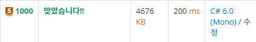

# Meister-Unity-assignment-1
<b>1주차 :</b> <a href="./week1/README.md">C#과 유니티 시작하기</a> 
<b>2주차 :</b> <a href="./week2/README.md">유니티 익숙해지기</a> 
<b>3주차 :</b> <a href="./week3/README.md">첫 게임 완성해보기</a> 
<b>4주차 :</b> <a href="./week4/README.md">자료구조 학습해보기</a> 
<b>5주차 :</b> <a href="./week5/README.md">자료구조 학습해보기2</a> 
<b>6주차 :</b> <a href="./week6/README.md">유니티 물리엔진과 이벤트함수</a> 
<b>7주차 :</b> <a href="./week7/README.md">C# 문자열과 Enum</a> 
<b>7주차 :</b> <a href="./week8/README.md">메터리얼, 파티클 시스템(VFX)</a>
  

## 강의내용 정리
<b>210907 :</b> <a href="./lecture/1-1_210907.md">OT와 유니티 물리엔진</a> 
<b>210909 :</b> <a href="./lecture/1-2_210909.md">콜라이더와 이벤트함수</a> 
<b>210916 :</b> <a href="./lecture/1-3_210916.md">문자열, Enum</a> 
<b>211013 :</b> <a href="./lecture/1-4_211013.md">메터리얼, 파티클 시스템(VFX)</a>
  

## 과제 제출 방법
과제는 카카오톡 1:1 대화로 제출합니다.

1.C# 과제 
 
학습한 내용과 관련있는 백준 문제를 C#으로 풀어서 카카오톡으로 문제 번호와 결과, 언어가 보이게 스크린샷을 찍어주시면 됩니다. 위 스크린샷을 참조해주세요.
 

2.유니티과제 
기본적으로 동작만 검사합니다. Unity Recoder나 영상촬영 툴을 이용하여 녹화한 영상을 보내주면 됩니다. 코드검사가 필요한 과제인 경우 프로젝트를 압축해서 보내주세요. (용량이 초과하는 경우 구글드라이브링크로 보내주세요)
  

과제 제출은 화요일 오후 10시까지 진행하며, 검사 이후 해당 깃허브 저장소를 통해 모범답안을 올리겠습니다.
