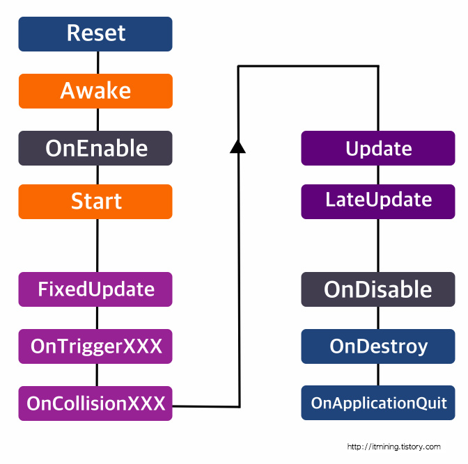

<h2>1-1차시 수업내용: OT, 유니티 물리엔진(Collider, Rigidbody)</h2>

<h3>유니티 물리엔진</h3>
<b>콜라이더</b>

- 유니티에서 충돌을 계산하는 범위
- 콜라이더의 모양과 크기는 모델의 모양과 크기와 별개로 설정해줄 수 있다
- 충돌이벤트는 발생하되, 충돌연산을 하지 않을 때는 'IsTrigger'를 체크한다.
<br><br>

<b>리지드바디</b>

- 유니티에서 물리연산을 수행하는 컴포넌트
- 콜라이더를 바탕으로 충돌연산을 수행한다
- isKinematic: 물리효과가 리지드바디에 영향을 주도록 할 지 결정한다(이 옵션을 체크하면 다른 콜라이더의 영향을 받지 않지만, 이 오브젝트는 다른 콜라이더에 영향을 줄 수 있다)
- useGravity: 현재 리지드바디에 중력을 적용할지 결정한다
- constraints: 리지드바디 물리연산의 자유도를 조절한다(특정 축으로 이동방지, 회전방지)
<br><br>

<h3>DeltaTime</h3>

- 프레임 사이 소요된 시간
- Update 함수 실행 간격
- 다른 시스템간의 동기화를 위해 이동, 회전시 곱해주는게 좋다
- DeltaTime을 곱해주지 않는다면 컴퓨터 사양에 따라 물리연산량이 달라질 수 있다.
<br><br>

<h3>스크립트</h>

```C#
using System.Collections;
using System.Collections.Generic;
using UnityEngine;

[RequireComponent(typeof(Rigidbody))]
public class RigidbodyCharacter : MonoBehaviour
{
    [SerializeField] float speed = 5f;
    Rigidbody rb;
    Transform tr;

    Vector3 dir = Vector3.zero;

    void Awake()
    {
        rb = GetComponent<Rigidbody>();
    }

    void Update()
    {
        dir.x = Input.GetAxis("Horizontal");
        dir.z = Input.GetAxis("Vertical");

        rb.velocity = dir * speed;
    }
}
```
<br><br>


<h3>유니티 이벤트 함수</h3>

</br>
<a href="https://itmining.tistory.com/47">사진출처</a>

- Awake: 오브젝트가 생성된 직후에 실행되며 주로 오브젝트의 초기화를 설정.
- Start: Awake 다음에 실행되며 주로 Awake에서 초기화된 다른 스크립트의 변수나 함수를 참조할 때 사용
- FixedUpdate: 고정적인 주기로 실행되며 주로 물리연산을 처리
- Update: 매 프레임마다 실행되며 반복처리하는 로직을 처리
- LateUpdate: Update가 끝난 후 실행. 일반적으로 3인칭 카메라 로직을 처리
