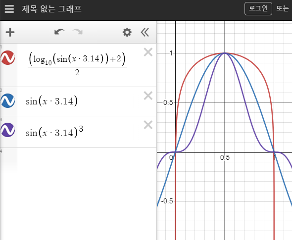

<h2>3-1차시 수업내용: 유용한 라이브러리 - 1</h2>

<h3>TextmeshPro</h3>

폰트 크기를 소수점 단위로 설정할 수 있어서 World Canvas에서 텍스트를 효과적으로 처리할 수 있다. 이러한 특성때문에 VR프로젝트에서 거의 필수적으로 사용된다. 이 외에도 다양한 기본 옵션들이 있어 텍스트 효과를 손쉽게 적용할 수 있으며, HTML과 CSS처럼 적용가능한 Rich Text로 기존 Text 컴포넌트 여러개를 사용하여 복잡하게 처리해야할 텍스트 작업을 한개의 오브젝트로 손 쉽게 처리할 수 있다.

- 폰트는 저작권에 매우 민감한 부분이라 꼭 무료폰트를 찾아서 사용하자.(네이버 나눔 글꼴 등)
- 한글 폰트 사용시 아틀라스 사이즈는 4000으로 설정해주는 것이 좋다.

<a href="https://m.blog.naver.com/cdw0424/221641217203">생성법 문서</a><br>
<a href="http://digitalnativestudios.com/textmeshpro/docs/">Online Documentation</a>

<h3>Dotween</h3>
Dotween은 특정 변수 값들을 일정 시간동안 부드럽게 변화시켜주는 역할을 한다. Transform, Material, Text, Camera, Light, Rigidbody등 유니티 핵심 컴포넌트에 손쉽게 사용할 수 있는 확장메서드를 제공해주며, 이를 활용하여 자연스러운 동작을 구현할 수 있다.

- 주로 컴포넌트의 확장메서드를 이용하여 많이 사용
- 메서드 체인(함수들을 .으로 연결해서 사용하는 것)을 이용하여 다양한 옵션 적용
- Ease타입을 지정해줘서 모션의 움직임 방법을 선택 가능

```C#
tr
    .DOMove(Vector3.up, 2f) // (0, 1, 0) 만큼 2초간 이동
    .SetEase(Ease.OutSine) // 이동시 OutSion의 Ease 적용
    .OnComplete(()=> render.material.DOColor(Color.black, 2f)); 
    // 이동 후 물체의 색을 2초동안 검은색으로 변환
```

<a href="https://m.blog.naver.com/hana100494/221320177107">기본 기능 설명</a><br>
<a href="https://m.blog.naver.com/hana100494/222084755392">Ease</a><br>
<a href="http://dotween.demigiant.com/documentation.php">공식문서</a>

<h3>게임수학과 Desmos</h3>

기본적인 Mathf 수학함수
```C#
// 절대값 함수
Debug.Log(Mathf.Abs(-4));

// 클램프 함수
// 각도 제한때 많이 사용
Debug.Log(Mathf.Clamp(-6, -4, 4));
Debug.Log(Mathf.Clamp( 2, -4, 4));
Debug.Log(Mathf.Clamp( 6, -4, 4));

// 올림, 버림, 반올림
Mathf.Ceil(2.3f); // 천장함수
Mathf.Floor(2.3f); // 바닥함수
Mathf.Round(2.5f);

// 소수점 비슷한지 계산
Debug.Log(Mathf.Approximately(2.3f, 2.3f));

// 선형보간
Mathf.Lerp(2, 3, 0.5f);
```

- 삼각함수: 회전이나 주기적인 움직임에 주로 사용
- 로그함수: 큰값과 작은값의 차이를 줄여줄 때 주로 사용(예: VR에서 물건던지기)
- 지수함수: 값의 범위를 줄여줄 때 주로 사용
<br><br>



- 파랑그래프: 일반적인 sin 그래프
- 빨간그래프: log함수를 이용해 sin 그래프를 더 넓게 변화시킴
- 보라그래프: 지수함수를 이용해 sin그래프를 더 좁게 변화시킴 

<a href="https://www.desmos.com/calculator?lang=ko">Desmos</a>

<h3>Mixamo</h3>

무료로 사용할 수 있는 휴머노이드 타입 애니메이션 제공 사이트

- 사용시 사용할 모델과 Mixamo에서 갖고온 애니메이션 모두 '휴머노이드' 타입으로 셋팅해야함
- 애니메이션 자체에 움직임이 있고, 이를 비활성화 하고 싶은 경우 Mixamo에서 'In Place'셋팅을 클릭하고 애니메이션을 받아와야함

<a href="https://www.mixamo.com/">Mixamo</a>


<h3>예시 프로젝트</h3>

<a href="https://www.youtube.com/watch?v=Hmho2MKpgyE">냥이의섬VR</a>
