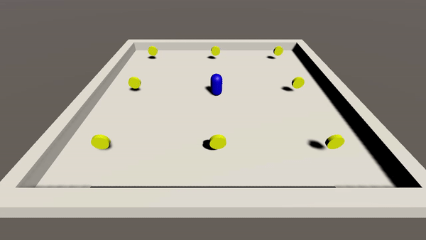
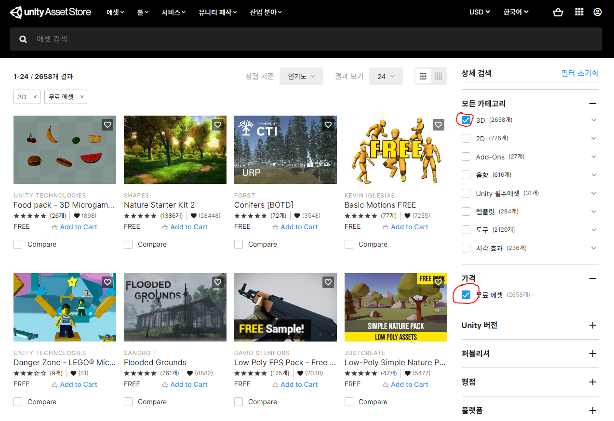

# 2주차 과제

## 답안
C#: <a href="./Csharp/3052.cs"> 링크 </a>
Unity: <a href="https://drive.google.com/file/d/1u0wdIhR-I_Ngsk0siZHfvLtY0R8io17M/view?usp=sharing">링크</a>

### 1) C# 과제
<a href="http://www.csharpstudy.com/CSharp/CSharp-Intro.aspx">
예제로 배우는 C# 프로그래밍 - 기초 문법</a> 
위 링크에서 C# 기초 문법을 학습합니다. 
범위: C# 예외 처리 ~ C# 전처리기 
 
<a href="http://www.csharpstudy.com/CSharp/CSharp-access-modifier.aspx">
예제로 배우는 C# 프로그래밍 - 고급 문법</a> 
위 링크에서 C# 고급 문법을 학습합니다. 
범위: C# 접근 제한자 ~ C# 제네릭 
  

### 문제
제네릭 자료구조 응용 문제 
제네릭 자료구조를 활용하여 아래 문제를 풀어주세요. 
(제네릭 자료구조 선언시 타입은 int로 설정해주세요) 
 
> 문제 
>> 나머지 
수 10개를 입력받은 뒤, 이를 42로 나눈 나머지를 구한다. 그 다음 서로 다른 값이 몇 개 있는지 출력하는 프로그램을 작성하시오. 

문제: <a href="https://www.acmicpc.net/problem/3052">백준 3052</a> 
힌트: List의 Contains(x) 함수로 List에 x가 포함되어있는지 확인할 수 있습니다.<a href="https://docs.microsoft.com/ko-kr/dotnet/api/system.collections.generic.list-1.contains?view=net-5.0">(MSDN 문서)</a> 
  

### 2) 유니티 과제
<a href="https://www.youtube.com/watch?v=gnO1GVRuKxk&list=PLO-mt5Iu5TeZa9dsqMVvXuSfVxwR_2AOz&index=8">골드메탈 - 유니티 입문 간단 3D 게임 [BE1]</a> 
 링크에서 학습합니다. 
범위: 유니티 3D 알아보며 설치해보아요[B7] ~ 키보드 마우스로 이동시켜보자![B12] 
(마지막 14번째 강의는 선택사항)
  

 
> 문제 
Rigidbody를 활용하여 동전을 먹는 게임을 만들어주세요. 동전의 삭제는 OnTriggerEnter 이벤트에서 Destory()를 실행하면 됩니다. (동전의 회전은 구현하지 않아도 됩니다.) 
  

### 3) 에셋스토어 과제
 
유니티 에셋스토어를 사용해보는 과제입니다. 앞으로 프로젝트를 진행하면서 직접 모델을 만들기는 힘드니 다른 유저들이 제작한 모델 에셋을 불러와서 사용할 것입니다. 이에 익숙해지기 위해 에셋스토어에서 3D모델을 다운받고 씬에 불러오는 연습을 해보세요! 위 사진처럼 '가격 - 무료 에셋'을 클릭하면 무료로 사용할 수 있는 에셋을 찾을 수 있습니다. 에셋들을 살펴보며 자신만의 게임을 기획해보세요!
 
<a href="https://learnandcreate.tistory.com/309">에셋스토어 사용하기 글</a>
   
다음주차에는 유니티의 튜토리얼을 따라해보며 하나의 완성된 게임을 제작할 예정입니다.
