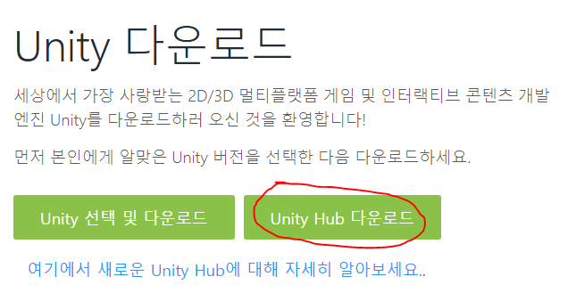
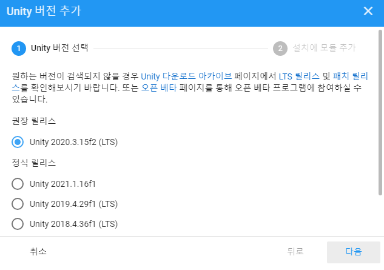

# 1주차 과제

과제입니다

## 1. 개발환경 셋팅하기
### 1) Visual Studio Community 2019 설치하기
<a href="https://visualstudio.microsoft.com/ko/downloads/">비쥬얼스튜디오 설치링크</a><br>
유니티에서 코드 작업을 위한 비쥬얼 스튜디오 커뮤니티 버전을 설치합니다. 2019 커뮤니티 버전에서는 함수 간 참조를 쉽게 확인할 수 있는 CodeLens를 지원해주고, 이를 자주 활용할 예정이기 때문에 같은 버전을 설치하는 것을 추천합니다.
<br><br>

### 2) Unity 2020.3.15f2 설치하기
<br>
<b>유니티 허브 다운로드</b>
<a href="https://unity3d.com/kr/get-unity/download"></br>
유니티 다운로드 사이트</a>에서 유니티 허브를 다운받아주세요. 유니티 허브는 유니티 프로젝트 및 설치를 관리할 수 있는 툴입니다. 유니티 허브를 설치하면 유니티 계정을 만들고 라이선스 활성화를 합니다.
</br></br>

</br>
라이선스 인증까지 끝났으면 설치 탭으로 와서 유니티를 설치해주세요. 강의를 진행하면서 사용할 버전은 최신 LTS버전인 <b>2020.3.15f2</b> 입니다. LTS버전은 장기간 안전하게 사용할 수 있는 버전입니다.
</br></br>

### 3) C# 과제
<a href="http://www.csharpstudy.com/CSharp/CSharp-Intro.aspx">
예제로 배우는 C# 프로그래밍 - 기초 문법</a><br>
위 링크에서 C# 기초 문법을 학습합니다.
범위: C# 프로그래밍 언어 ~ C# yield
<br><br>

### 문제
조건문 문제<br>
> 문제<br>
>> 두 수 비교하기<br>
두 정수 A와 B가 주어졌을 때, A와 B를 비교하는 프로그램을 작성하시오.<br>

문제: <a href="https://www.acmicpc.net/problem/1330">백준 1330</a>
```C#
//힌트: 아래와 같이 코드를 입력하면 입력값을 정수로 받을 수 있습니다.
    string[] s = Console.ReadLine().Split();
    int a, b;
    a = Int32.Parse(s[0]);
    b = Int32.Parse(s[1]);
```
<br><br>

### 4) 유니티 과제
<a href="https://www.youtube.com/watch?v=7plGPXkmnxQ&list=PLO-mt5Iu5TeZa9dsqMVvXuSfVxwR_2AOz&index=1">골드메탈 - 유니티 입문 간단 3D 게임 [BE1]</a><br>
 링크에서 학습합니다.<br>
범위: 유니티 3D 알아보며 설치해보아요[B0] ~ 유니티 프로그래밍의 시작, 콘솔창에 메시지 띄워보기[B3]<br>
([B4]프로그래밍 기초 강의는 C#과제 내용이랑 겹치므로 필수적으로 듣지 않아도 됩니다)
<br><br>

</br>
> 문제<br>
유니티 기본 오브젝트(Cube, Cylinder 등)를 이용하여 위 사진과 비슷하게 시계를 만들어주세요. 시침과 분침의 각도는 상관 없습니다. 완성된 오브젝트는 스크린샷으로 캡쳐해서 보내주세요.

<br><br>
### 추가) 학생계정으로 유니티Pro 라이센스 받기
유니티 학생계정 혜택
- 유니티 콜라보레이션 (클라우드 기반 협업)
- 빌드파일 인트로 로고 제거 가능
- 고품질 무료 에셋

#### 링크
<a href="https://r35s.tistory.com/42">등록방법</a></br>
<a href="https://store.unity.com/kr/academic/unity-student">유니티 Student플랜 혜택 사이트</a>

### 2021-08-05 추가
현재 학생 이메일이 'ac.kr'도메인으로 끝나지 않아 학생인증을 받기 위해서는 추가적인 인증이 필요하다고 합니다. 학생인증이 강의에 꼭 필요하지는 않으나 원한다면 <a href="https://github.blog/2019-07-30-how-to-get-the-github-student-developer-pack-without-a-student-id/">링크</a>를 참고해서 인증을 진행하면 됩니다.
