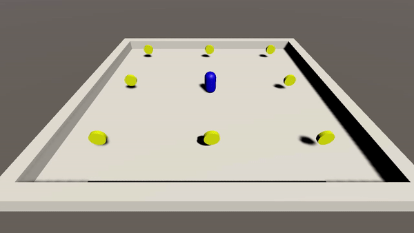

# 2주차 과제 - 작성중

### 2) 유니티 과제
<a href="https://www.youtube.com/watch?v=gnO1GVRuKxk&list=PLO-mt5Iu5TeZa9dsqMVvXuSfVxwR_2AOz&index=8">골드메탈 - 유니티 입문 간단 3D 게임 [BE1]</a> 
 링크에서 학습합니다. 
범위: 유니티 3D 알아보며 설치해보아요[B7] ~ 키보드 마우스로 이동시켜보자![B12] 
(마지막 14번째 강의는 선택사항)
  

 
> 문제 
Rigidbody를 활용하여 동전을 먹는 게임을 만들어주세요. 동전의 삭제는 OnTriggerEnter 이벤트에서 Destory()를 실행하면 됩니다. (동전의 회전은 구현하지 않아도 됩니다.)
